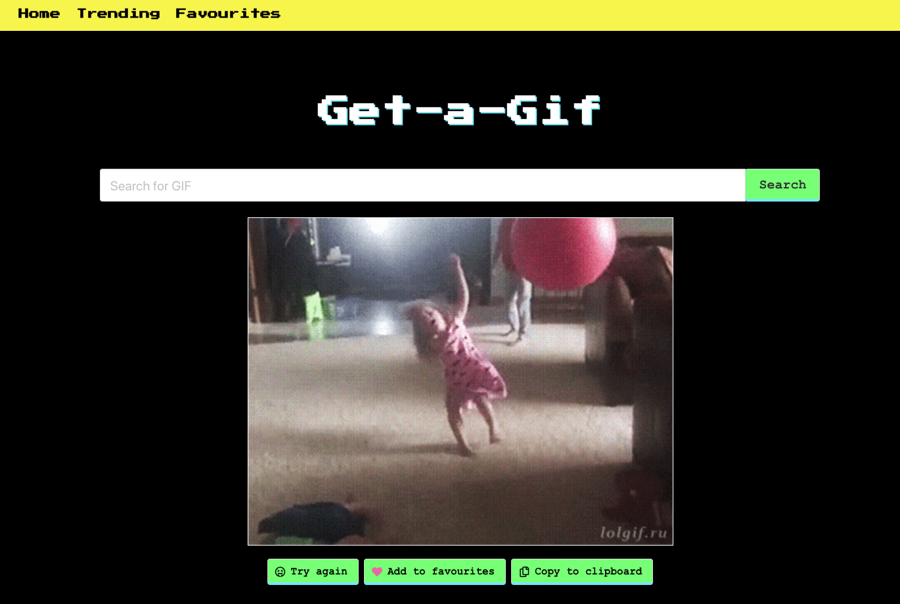
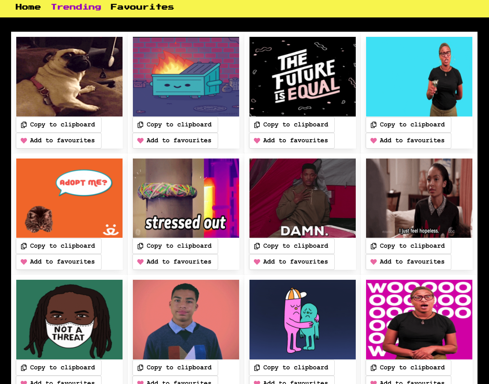
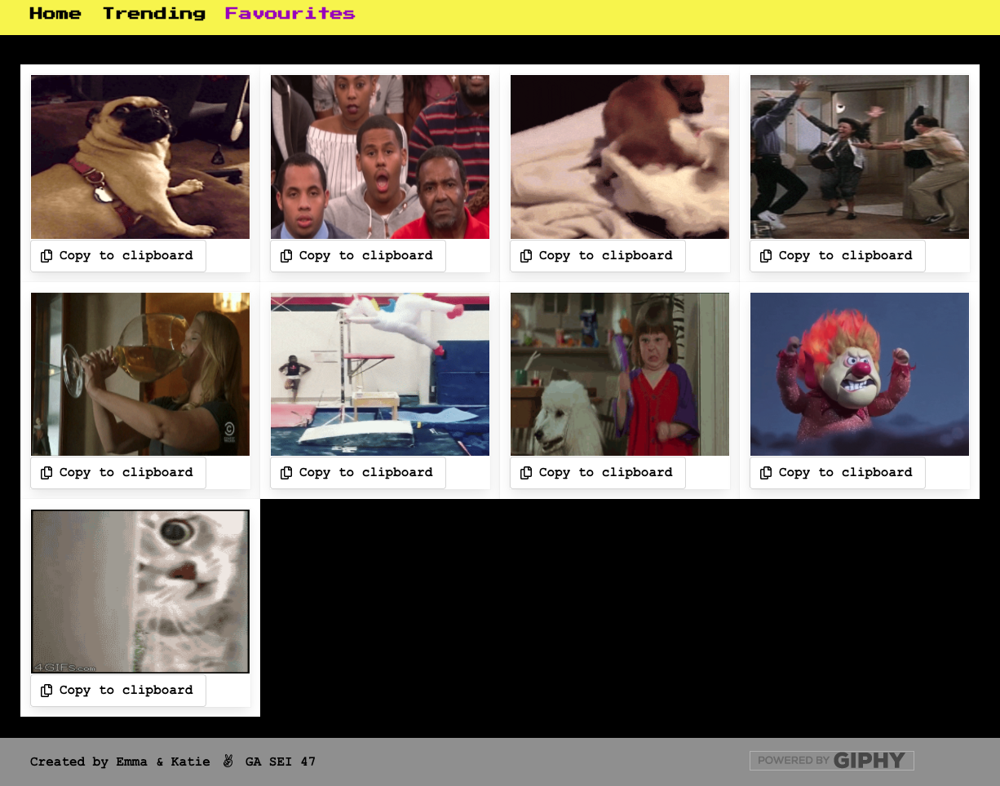
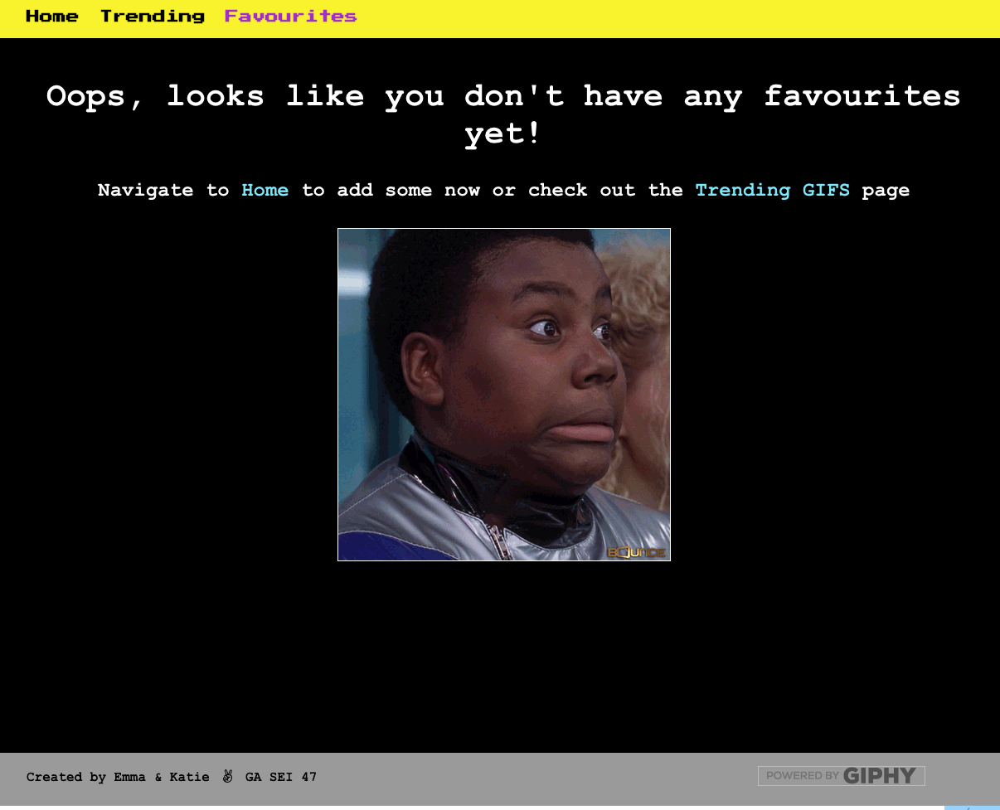
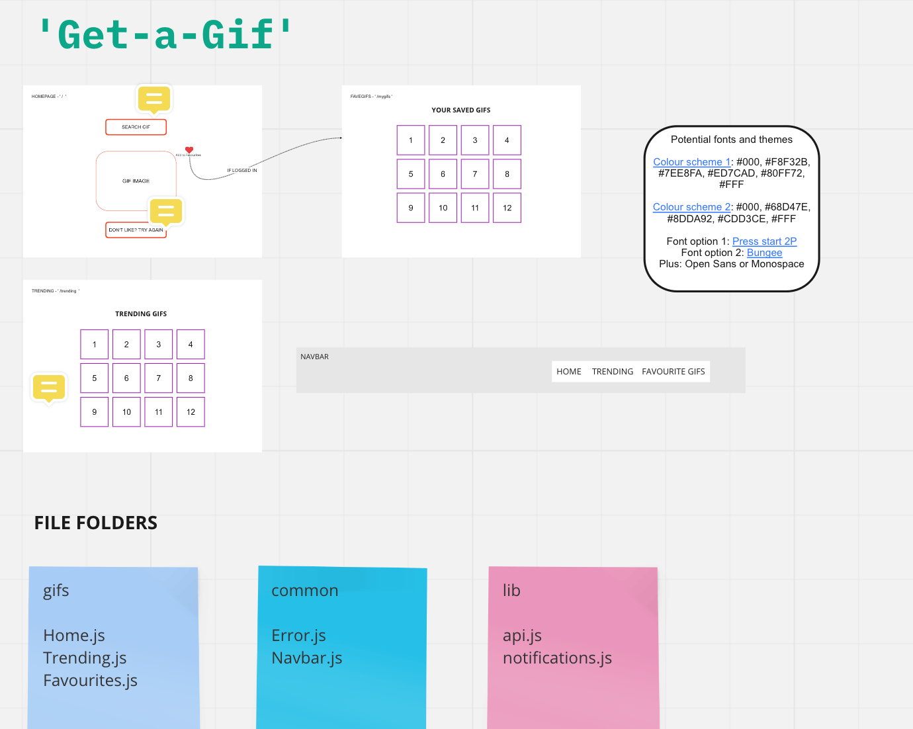
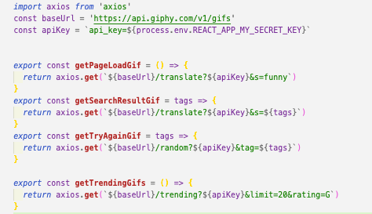
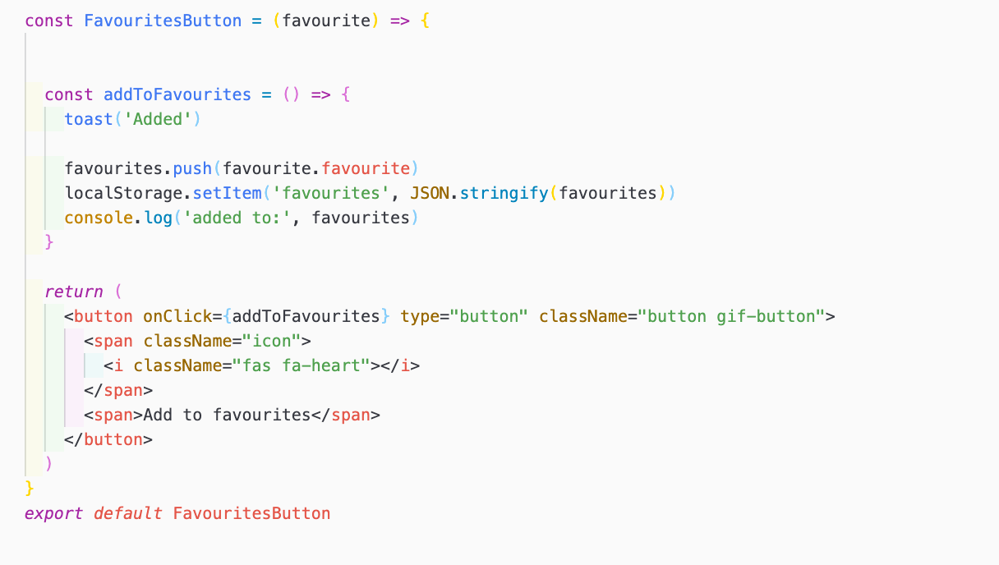

# SEI147 - PROJECT 02: REACATHON

## Overview: Get-a-Gif

Get-a-Gif was a pair coded project built within 48 hours. It is a fun app which pulls from the Giphy API and allows users to search for and save Gifs. This was my first project using React and a public API. 

Please see a hosted version here:  https://get-a-gif.netlify.app
- - - -
### Brief
The app had to: 

* **Consume a public API** 
* **Have several components** - At least one classical and one functional.
* **The app can have a router** - with several "pages", this is up to your disgression and if it makes sense for your project.
* **Include wireframes** - that you designed before building the app.
* **Be deployed online** and accessible to the public, we used Netlify.

- - - -

### Technologies Used 
* React
* JavaScript
* SCSS
* Bulma
* Axios
* Insomnia
* HTML
* Yarn
* Insomnia 

- - - -

### Screenshot Walk-Through

1. Home Page - the main landing page showed gifs based on the keyword ‘funny’. It allowed users to put their own keywords to search for the Gif of their choice, add to their favourites and copy a link to the Gif. 

2. Trending Page - the trending page shows the top 20 trending gifs on GIPHY at the time of viewing

3. Favourites Page - Favourites are stored in local storage for users to come back to later 

4. Error Page if no favourites added - linked the users back to search for gifs or trending gifs to start adding to their favourites.

- - - -

### Functionality 

The app allows users to:
* Search for a Gif based on keywords
* See the top 20 latest trending Gifs on Giphy
* Add Gifs to favourites
* Copy a Gif link to the clipboard 
- - - -

### Process

We spent the first afternoon of the project coming up with different ideas and looking for a suitable API's to support these. We found that the information provided alongside some API's was quite brief making using the API more complex to work with. Giphy API has brilliant developer pages alongside it which allows you to easily understand what is needed for the requests. 

Once we agreed on using the Giphy API we made sure we could get our requests working in Insomnia and our wireframe came along quite quickly which we successfully stuck to throughout the project & used to keep in mind which aspects we thought were necessary and which were nice to haves. 

The second morning was spent setting up the app in React and linking to the API. By the end of the first day we had all the app pages and routes set up and the API calls working aswell as the majority of the styling done using SASS and Bulma. 

#### Featured Piece of Code 1

We used different API endpoints to ensure that user request returned a ariety of results. Initially on page load we hardcoded funny into the translate API endpoint to ensure that a good gif would show.

- - - -

On the day of submission we spent time refactoring our code, adding extras like toasts to let users know they had successfully favourited or copied gifs, loading spinners and lazy loading for the trending page. 

We pair-coded the whole project, swapping the typist every hour.

#### Featured Piece of Code 2 

The app has a favourites function which stores favourite Gifs in Local Storage for users to view if they came back to the page later. 

- - - -

### Wins and Blockers 

One of the biggest blockers we had was initally we couldnot find an API to support any of our ideas. The lack of information provided with some of these meant it was very hard to get the requests to work. In the end this did work out in our favour as we kept looking and found Giphy who's helpful documentation definitely supported the success of this project.

The biggest win was the planning of the project. We spent time at the start ensuring we knew exactly what we wanted from the project and how it should look which enabled us to stay focused and have time to add some of the extra features we had hoped for.
- - - -

### Future Features 
If we had more time I would like to to make the app mobile friendly so you could just copy your most used gifs from there into your most used apps. 
- - - -

### Key Learnings

Key learning was that planning properly is imperative and saves time in the long run. 

