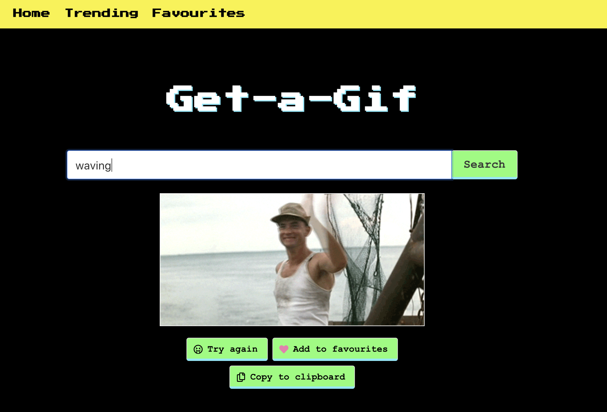

# SEI147 - PROJECT 02: REACATHON
## Get-a-Gif

This was my first project using React and a public API. 

Please see a hosted version here:  https://get-a-gif.netlify.app
- - - -
### Brief
A pair coded project built within 48 hours. The app had to: 

* **Consume a public API** 
* **Have several components** - At least one classical and one functional.
* **The app can have a router** - with several "pages", this is up to your disgression and if it makes sense for your project.
* **Include wireframes** - that you designed before building the app.
* **Be deployed online** and accessible to the public, we used Netlify.

- - - -

### Technologies Used 
* React
* JavaScript
* SCSS
* Bulma
* Axios
* Insomnia
* HTML
* Yarn

- - - -

### Approach Taken 
We built a fun React App which pulls from the Giphy API and allows users to search for and save Gifs.
Once we had agreed on using Giphy we drew up wireframes of the pages we wanted to achieve and agreed on deliverables and nice to haves. 
We pair-coded the whole project, swapping the typist every hour.

- - - -

### Screenshot Walk-Through

1. Home Page - the main landing page showed gifs based on the keyword ‘funny’. It allowed users to put in a keyword to search for the Gif of their choice, add to favourites and copy a link to the Gif. 

2. Trending Page - the trending page shows the top 20 trending gifs on GIPHY at the time of viewing

3. Favourites Page - Favourites were stored in local storage for users to come back to later 

4. Error Page if no favourites added - linked the users back to search for gifs or trending gifs to start adding to their favourites

- - - -

### Functionality 

The app allows users to:
* Search for a Gif based on keywords
* See the top 20 latest trending Gifs on Giphy
* Add Gifs to favourites
* Copy a Gif link to the clipboard 
- - - -

### Process

Once we agreed on using the Giphy API our wireframe came along quite quickly which we successfully stuck to throughout the project & used to keep in mind which aspects we thought were necessary and which were nice to haves. 

We spent the first afternoon choosing the API, producing the wireframe for our app and trying out the different API endpoints using Insomnia. 

The second morning was spent setting up the app in React and linking to the API. By the end of the first day we had all the app pages and routes set up and the API calls working aswell as the majority of the styling done using SASS and Bulma. 

On the day of submission we spent time refactoring our code, adding extras like toasts to let users know they had successfully favourited or copied gifs, loading spinners and lazy loading for the trending page. 

#### Featured Piece of Code 1 

We decided to add a favourites function which stored favourites in Local Storage for users to view if they came back to the page later. 

- - - -

### Wins and Blockers 

One of the biggest blockers we had was working with some of the packages we installed which came with minimal documentation and took up more time than was necessary.

The biggest win was the successful planning of the project. We spent time at the start ensuring we knew exactly what we wanted from the project and how it should look which enabled us to stay focused and have time to add some of the extra features we had hoped for.
- - - -

### Future Features 
If we had more time I would like to to make the app mobile friendly so you could just copy your most used gifs from there into your most used apps. 
- - - -

### Key Learnings

Key learning was that planning properly is imperative and saves time in the long run. 

